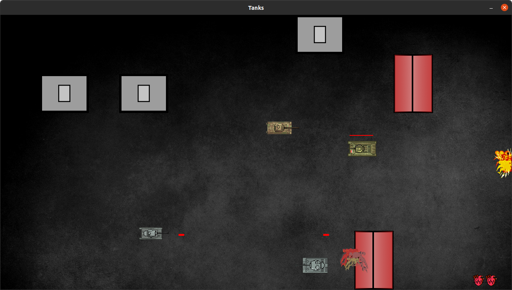

# Mad Tanks

Mad Tanks is a simple 2D top view game with tanks.
Player's goal is to destroy all enemy tanks on the board.
The game was created with Python and PyGame. Code is written in OOP concept. Most of the functionality except displaying things on the screen os written manually as PyGame functions were not suitable for this type of game.

### **Snapshot of menu**

### **Snapshot of controls**

### **Snapshot of gameplay**
